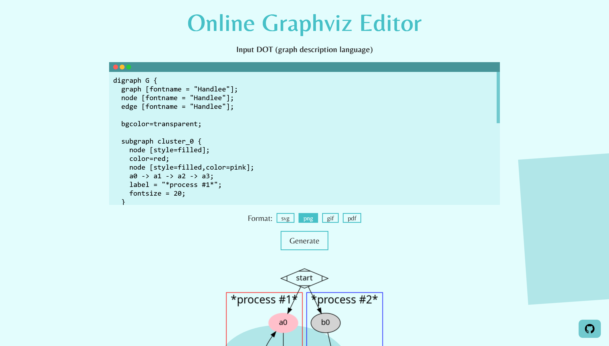

<h2 align="center">Online Graphviz Editor </h2>



<h4 align="center">Generates Graphviz images that can be used directly on any website without a need to host images on a server </h4>

<p align="center">
<a href="https://github.com/ztjhz/graphviz-editor/blob/master/LICENSE" target="blank">

</a>
<a href="https://github.com/ztjhz/graphviz-editor/fork" target="blank">

</a>
<a href="https://github.com/ztjhz/graphviz-editor/stargazers" target="blank">

</a>
<a href="https://github.com/ztjhz/graphviz-editor/issues" target="blank">

</a>
<a href="https://github.com/ztjhz/graphviz-editor/pulls" target="blank">

</a>
<a href="https://twitter.com/intent/tweet?text=👋%20Check%20this%20amazing%20repo%20https://github.com/ztjhz/graphviz-editor,%20created%20by%20@nikushii_"></a>
</p>

<p align="center">
    <a href="https://graphviz.tjh.sg">View Demo</a>
    ·
    <a href="https://github.com/ztjhz/graphviz-editor/issues/new/choose">Report Bug</a>
    ·
    <a href="https://github.com/ztjhz/graphviz-editor/issues/new/choose">Request Feature</a>
</p>

## 👋🏻 Introducing `Online Graphviz Editor`

`Online Graphviz Editor` is a tool that allows users to generate Graphviz images online. Users can then copy the image URL and use it directly on any website **without** a need to host images on a server. The frontend is powered by [**ztjhz/graphviz-editor**](https://github.com/ztjhz/graphviz-editor) and the backend is powered by [**ayaka14732/graphviz-server**](https://github.com/ayaka14732/graphviz-server).

## 🚀 Use Online Graphviz Editor

Please access Online Graphviz Editor using the URL:

> [The Demo Link](https://graphviz.tjh.sg)

Liked it? Please give a ⭐️ to <b>Online Graphviz Editor</b>.

_Many Thanks to all the `Stargazers` who has supported this project with stars(⭐)_

[](https://github.com/ztjhz/graphviz-editor/stargazers#gh-light-mode-only)

[](https://github.com/ztjhz/graphviz-editor/stargazers#gh-dark-mode-only)

## 🔥 Features

`Online Graphviz Editor` comes with a bundle of features already. You can do the followings with it,

- 🌸 Modern and beautiful website
- 🔗 Directly generate a link to your graphviz image that can be used anywhere
- 📱 Responsive and mobile-friendly

## 🏗️ How to Set up `Online Graphviz Editor` for Development?

1. Clone the repository

```bash
git clone https://github.com/ztjhz/graphviz-editor.git
```

2. Change the working directory

```bash
cd graphviz-editor
```

3. Open a live server in that directory

```bash
python -m http.server 8080
```

That's All!!! Now open [localhost:8080](http://localhost:8080/) to see the app.
